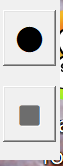
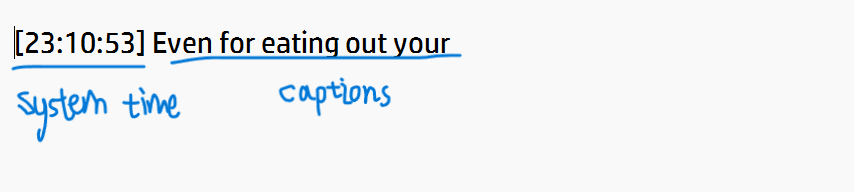

# Save Live Captions

**Tired of losing live captions on Windows?**  This is a simple tool to save the content of live captions! You can also download from release.

###  Features

---

- Save live captions to a text file.
- Minimalist floating dashboard.
- Customizable save location.

### Guidelines

---

1. Before you open this application, make sure you already **open the live captions on Windows** (or it will exit automatically). Then double click the `SaveLiveCaptions.exe`. A small dashboard will appear in the top-left corner of your screen. You can drag the background to move this window.

  

2. The **● (Circle)**  button is "start to save captions" and the **■ (Square)** button is "stop and exit the application". 

3. **Start saving:** When you click the circle button, a file dialog will open to choose a save location. If you don't choose the direction, the default location is `~/Documents/captions`. 

4. **Stop and exit:** When you click the square button, it stops and exit the application. You can find your captions file `YYYY-MM-DD_HH-MM-SS_captions.txt` in the chosen location like following.

## License

This project is licensed under the MIT License.

